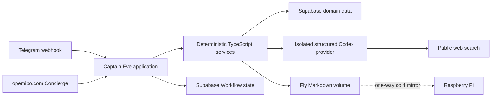

# Captain architecture

This document explains how Captain is assembled and where each kind of state
lives. Deployment, backup, and recovery commands live in
[`runbook.md`](runbook.md).

## Shape of the system

Captain is one Eve application running as one long-lived Fly.io machine. Eve is
the application boundary rather than a separate worker or an additional
service.



Production therefore has three required infrastructure components:

1. One Fly machine running Captain.
2. One attached Fly volume containing Markdown memory.
3. Supabase Postgres for durable Workflow and operational data.

The Raspberry Pi is an optional recovery mirror. It is not part of the live
request path and never writes to production.

## Request flow

### Telegram owner

1. Telegram sends a signed webhook to `/eve/v1/telegram`.
2. The Telegram channel rejects groups and users other than the configured
   owner.
3. Eve resumes the owner's durable session in Supabase Workflow.
4. At the turn boundary, Captain loads current Markdown memory and recent
   journals from the Fly volume.
5. Eve chooses an allowed Captain tool or answers directly.
6. Deterministic services perform approved side effects and send the response.

There is no separate Captain Telegram queue or polling process. Eve and
Workflow own durable turn delivery.

### Public Concierge

1. `opemipo.com` calls the existing `/v1/concierge/*` routes.
2. The Concierge channel creates a visitor principal.
3. Visitor instructions expose public site knowledge and handoff behavior only.
4. Owner memory and owner-only tools are unavailable to the visitor.

### Scheduled work

1. Eve invokes one dispatcher every minute.
2. The dispatcher asks the Supabase-backed scheduler for due jobs.
3. A deterministic handler or named task subagent produces the result.
4. Deterministic services validate side effects and record the run.

Interactive flight discovery returns structured Duffel inventory to Eve. When
the owner requests a broader public-web comparison, Eve can also call the
owner-only `research_web` tool with a closed JSON request. Codex returns ranked,
sourced JSON in the same turn; Eve—not Codex—owns interpretation and delivery.
There is no free-form Codex request or autonomous Telegram follow-up path.

Codex never receives traveller identities or Captain credentials and does not
book flights or perform other side effects.

Codex CLI authentication persists at `/data/codex`, outside the
`/data/captain` memory subtree mirrored to the Pi. Each research run gets a new
temporary working directory while reusing only that CLI authentication home.

## Responsibility boundaries

| Layer | Owns | Does not own |
| --- | --- | --- |
| Eve | Sessions, turns, channels, approvals, schedules, tool invocation, named subagents | Provider-specific business rules or direct unrestricted machine access |
| `agent/` | Eve declarations, principal-aware instructions, channels, schedules, and thin tool adapters | Core domain implementations |
| `services/` | Memory operations, provider calls, structured research validation, risk controls, persistence, and outbound delivery | Session orchestration |
| Supabase | Workflow persistence and operational/domain records | Personal Markdown memory |
| Fly volume | Authoritative personal memory and journals | Workflow or domain tables |
| Raspberry Pi | Read-only recovery copies | Live reads, live writes, or agent execution |

## State ownership

### Markdown on the Fly volume

`CAPTAIN_MEMORY_ROOT=/data/captain` contains:

```text
memory/*.md
journals/YYYY/YYYY-MM-DD.md
```

Captain is the only production writer. Local development uses `.memory/` by
default. The Pi copies the production tree hourly and installs each snapshot
atomically.

### Supabase

Supabase stores:

- Eve Workflow runs, events, hooks, streams, and queues.
- Telegram conversation mirrors.
- Scheduled jobs and job-run history.
- Concierge conversations and delivery events.
- Flights, trades, token usage, and other operational records.

## Repository map

- `agent/` — Eve-specific declarations and adapters.
- `services/` — framework-neutral application and domain logic.
- `supabase/` — schema migrations and Workflow role setup.
- `deploy/pi-sync/` — optional Raspberry Pi cold-mirror package.
- `tests/` and `evals/` — deterministic tests and agent evaluations.
- `scripts/` — one-off setup and verification commands.

## Intentional constraints

- Production remains one Eve process on one Fly machine.
- Memory has one authoritative writer: the Fly volume.
- The Pi remains outside the live request path.
- Supabase remains the durable operational database.
- Unsafe shell, filesystem, browser, computer, and unrestricted web tools stay
  disabled on the root agent.
- Codex runs read-only in an empty temporary directory with shell, apps,
  subagents, hooks, goals, and memory disabled. It receives only a validated
  research object and must return JSON conforming to the provider schema; live
  web search is required for every request.
- Its ChatGPT-managed CLI credential is file-backed on the Fly volume and is
  not included in the Pi memory mirror.
- Web-discovered fares remain advisory; Duffel is the only bookable inventory
  source.

These constraints prevent the framework redesign from turning into a
distributed multi-worker system. See [`runbook.md`](runbook.md) for operating
the deployed system.
